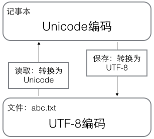

## 基础

- input('提示文本')可以接收交互式命令行输入。
- Python 是大小写敏感的。

### 数值

- 整数类型可以在数字中添加\_用来分隔数字，例如 100000 和 100_000 是等价的。
- 整数运算永远是精确的，浮点数运算存在四舍五入的误差，除法计算结果是浮点数，即使是两个整数恰好整除，结果也是浮点数。
- 整数的地板除//永远是整数，即使除不尽（10 // 3 == 3）；余数运算，可以得到两个整数相除的余数（10 % 3 == 1）。
- Python 的浮点数也没有大小限制，但是超出一定范围就直接表示为 inf（无限大）。
- 转义字符 \ 可以转义很多字符，python 提供了 r''表示''内部的字符串默认不转义。
- 如果字符串内部有很多换行，用\n 写在一行里不好阅读，python 允许用'''...'''的格式表示多行内容。
- python 的布尔类型值为 True/False，布尔运算符用 and、or 和 not 运算（不是 &&, ||, !）。
- 空值是 python 中一个特殊值，用 None 表示，不同于 0。

### 变量

- 变量名必须是大小写英文、数字和\_的组合，且不能用数字开头。
- 等号=是赋值语句，可以把任意数据类型赋值给变量，同一个变量可以反复赋值，而且可以是不同类型的变量。
- 常量就是不能变的变量，全部大写的变量名表示常量只是一个习惯上的用法，根本没有任何机制保证 PI 不会被改变。

### 字符串

- 计算机要处理文本，就必须先把文本转换为数字才能处理，通常用一串数字对文本进行编码。
- 计算机 8 比特位（bit）为一个字节（byte）——最大整数是 2^8-1=255。
- 通常的字符编码有 ASCII（一个字节） 和 Unicode （通常 2 个字节，特殊语言符号用 4 个字节）
- UTF8 可变长编码：把一个 Unicode 字符根据不同的数字大小编码成 1-6 个字节，常用的英文字母被编码成 1 个字节，汉字通常是 3 个字节，只有很生僻的字符才会被编码成 4-6 个字节。如果你要传输的文本包含大量英文字符，用 UTF-8 编码就能节省空间。
- 在计算机内存中，统一使用 Unicode 编码，当需要保存到硬盘或者需要传输的时候，就转换为 UTF-8 编码。例如：用记事本编辑的时候，从文件读取的 UTF-8 字符被转换为 Unicode 字符到内存里，编辑完成后，保存的时候再把 Unicode 转换为 UTF-8 保存到文件：
  
- ord()函数获取字符的整数（十进制）表示，chr()函数把编码转换为对应的字符。
- 通过字符串''.encode('utf-8')或 b'\xe4'.decode('utf-8')来对字符串和字节编码之间转换。
- % 运算符就是用来格式化字符串的，与 C 语言 printf 类似，如果格式化中存在%字符，则通过%%转义最终显示%。
- 另一种格式化字符串是：使用字符串的 format()方法，它会用传入的参数依次替换字符串内的占位符{0}、{1}。
- 另一种格式化字符串是：以 f 开头的字符串称之为 f-string，它和普通字符串不同之处在于字符串如果包含{xxx}，就会以对应的变量替换。

### 列表

- 列表是一种有序的集合，其中的元素可以是不同类型的，元素也可以是另一个 list，通过[]声明：list = ['Joe', 'Jack', 123];
- len()输出列表的元素个数，例如：len(list) == 3
- 取出列表元素，list[0]，索引值以 0 开头；也可以通过-1 取出列表最后一个元素，-2 是倒数第二个以此类推。
- 当索引超出了范围时，Python 会报一个 IndexError 错误。
- list.append()列表末尾插入，list.insert(index, element)指定索引位置插入，list.pop()删除末尾元素，list.pop(index)删除指定索引的元素。

### 元组

- 元组与列表类似，但是元组一旦创建不能修改，即元组中元素的指向不变，如果元素是列表，修改元组中列表内容是可以的。通过()声明：t = ('Joe', 'Jack');
- 在显示只有 1 个元素的 tuple 时，也会加一个逗号,，以免你误解成数学计算意义上的括号。定义 t=(1,)才是一个元组，t=(1)其实是 t=1。

### 条件判断

- 条件语句在判断空 list 和空 tuple 时，也会认为是 False

### 模式匹配（python3.10 之上才支持）

- match case，case \_: 表示匹配任意值

### 循环

- 循环有两种，一种是 for...in 循环，依次把 list 或 tuple 中的每个元素迭代出来；另一种一种是 while 循环。
- range(number)函数生成从 0 开始的 number 个数字序列。list()函数可以将变量转换成 list 类型。
- break 语句可以在循环过程中直接退出循环，而 continue 语句可以提前结束本轮循环，并直接开始下一轮循环。

### 字典 dict

- python 中的字典类似于 JavaScript 中的对象，通过 dict = { "a": 1, "b": 2}
- 判断某个值是否在字典中：'value' in dict
- 通过 get 方法获取值并给出一个默认值：dist.get('c', 3)
- 通过 pop(key)方法，对应的 value 也会从 dict 中删除

### 不重复集合 set

- set 是一组 key 的集合，且不能重复，set 可以看成数学意义上的无序和无重复元素的集合。
- 要创建一个 set，需要提供一个 list 作为输入集合，若 list 中有重复元素，则会自动过滤掉。例如 s = set([1,1,2,3])
- s.add(element)添加元素
- s.remove(element)删除元素
- set 中不可放入可变元素，例如 list，也就是说 s.add([1,2])会报错
